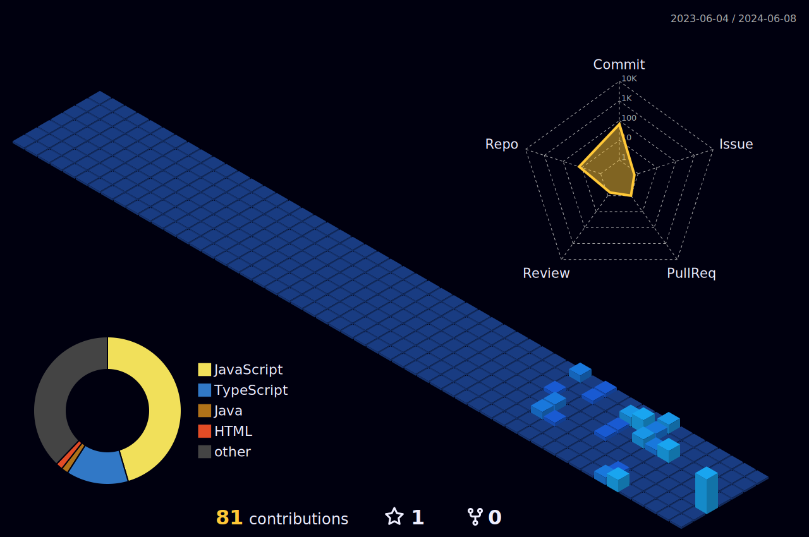

<h2 align="left">Hi 👋! My name is Ahmad Abdulmajid and I'm a Software Engineer</h2>

###

  
  
  

###

###

  
  
  
  
  
  
  
  
  
  
  
  
  

###

  
  

###

 

  
📈 More Stats

   
 

 <a href="https://github.com/Tirador1"> 
   

  
  
 </a>
<a href="https://github.com/Tirador1"> 
   
  </a> 
  
    
  
 

</a>  
 

 

<!--SNAKE-->

###
