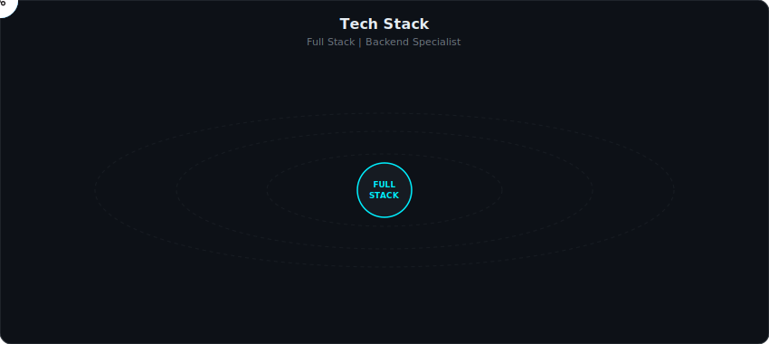

<div align="center">

<!-- ═══════════════════ HEADER ═══════════════════ -->
<a href="https://github.com/Tirador1">
  
</a>

<br/>

<!-- ═══════════════════ CONNECT ═══════════════════ -->

[](mailto:ahmad0abdulmajid@gmail.com)&nbsp;&nbsp;
[](https://www.linkedin.com/in/ahmadabdulmajid)&nbsp;&nbsp;
[](https://github.com/Tirador1)

<br/>

<!-- ═══════════════════ ABOUT ═══════════════════ -->

```
 I build cybersecurity platforms and threat intelligence systems
 that process massive datasets, correlate identities across networks,
 and enforce fine-grained access control over sensitive information.

 My stack: Spring Boot microservices, Kafka pipelines, PostgreSQL,
 Redis caching, and React frontends — all built for scale and security.
```

<br/>

<!-- ═══════════════════ ARCHITECTURE ═══════════════════ -->
<a href="https://github.com/Tirador1">
  
</a>

<br/>

<!-- ═══════════════════ CODE SHOWCASE ═══════════════════ -->
<a href="https://github.com/Tirador1">
  
</a>

<br/>

<!-- ═══════════════════ TECH ORBIT ═══════════════════ -->
<a href="https://github.com/Tirador1">
  
</a>

<br/>

<!-- ═══════════════════ STATS ═══════════════════ -->
<a href="https://github.com/Tirador1">
  
</a>

<br/>

<!-- ═══════════════════ LANGUAGES ═══════════════════ -->
<a href="https://github.com/Tirador1">
  
</a>

<br/>

<!-- ═══════════════════ SNAKE ═══════════════════ -->
<a href="https://github.com/Tirador1">
  
</a>

</div>
